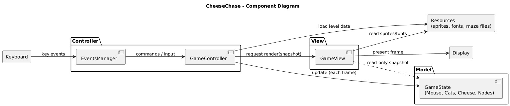
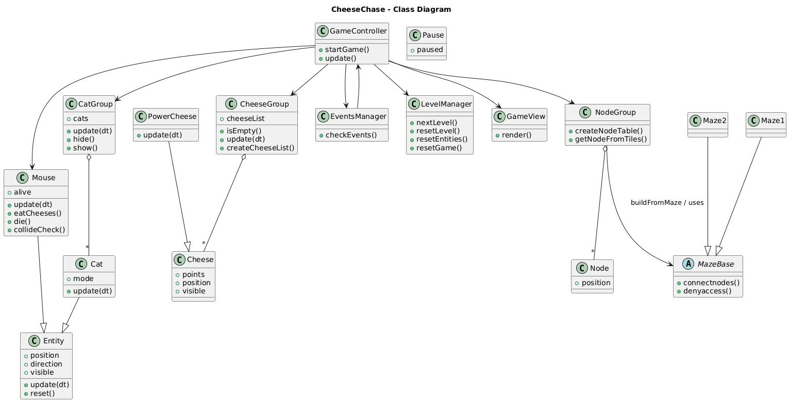
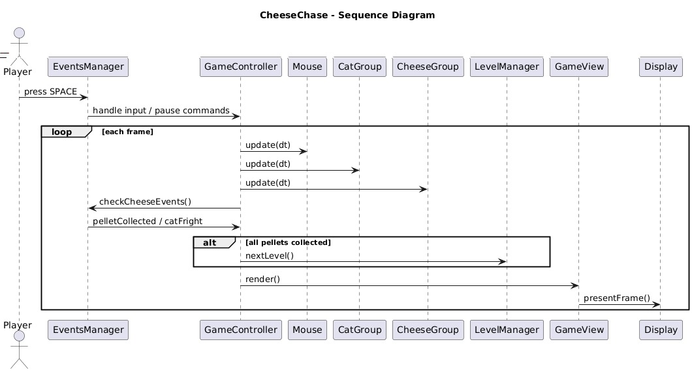
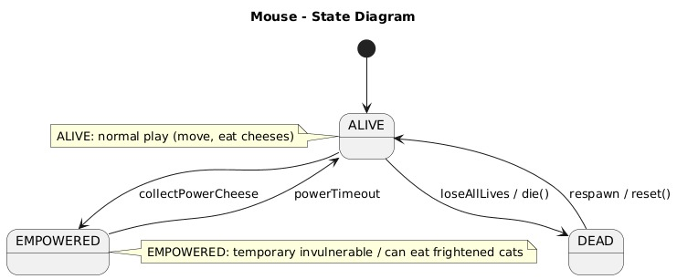
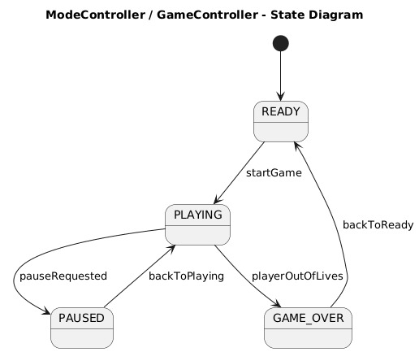
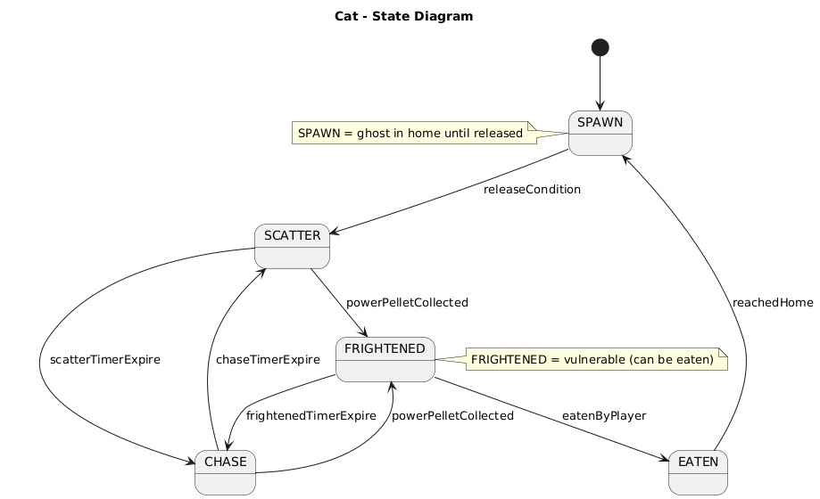

# Design

This chapter describes the main design choices adopted to satisfy the system requirements identified in the analysis. The goal is to illustrate the structure and behaviour of the system independently of any specific implementation details, so that the same architecture could be applied even with different technologies.

## Architecture

The game adopts a layered, object-oriented architecture based on the Model–View–Controller (MVC) pattern. This choice cleanly separates responsibilities, simplifies reasoning about the system, and supports extensibility (for example, adding new levels or enemy types).

- Model: Contains all core game logic, including Mouse, CatGroup, CheeseGroup, PowerCheese, node structures, collision rules, and scoring.
- View: Manages all graphical rendering, including sprites, animations, UI elements, and visual feedback.
- Controller: Interprets player inputs, manages events, updates the model accordingly, coordinates with the view, and handles level progression.

A high-level overview of how input, controller logic, model state, and rendering interact is shown in the diagram below.

## Infrastructure

Cheese-Chase runs entirely as a local desktop application, with no servers, databases, or background services.  
All components run within a single local process on the user's machine.  
There is no network communication, distributed storage, or remote coordination between components.

## Modelling

### Domain Driven Design (DDD) Modelling

The system is organised into three main bounded contexts:

- Gameplay: Mouse, CatGroup, CheeseGroup, PowerCheese.
- Game State: score, lives, level progression, pause logic.
- Rendering: sprites and visual components.

Domain concepts include:

- Entities: Mouse, Cat, Cheese, PowerCheese.
- Aggregates: CatGroup, CheeseGroup.
- Domain Services: LevelManager, EventsManager, ModeController.

### Object-Oriented Modelling

The main classes and their responsibilities include:

- Mouse: movement, collision handling, cheese collection, life management.  
- Cat: AI behaviour, movement, state transitions (chase, scatter, frightened, spawn).  
- Node / NodeGroup: maze connectivity and navigation graph.  
- Cheese / CheeseGroup: cheese positions and collection logic.  
- GameController: coordination of the game loop.  
- EventsManager: detection of collisions and input.  
- LevelManager: level transitions and resets.  
- Pause: pause state management.

A class diagram summarising these relationships is shown below.

## Interaction

Components interact continuously through the game loop:

1. The player presses a key.  
2. The controller processes the input and updates the model (for example, Mouse direction).  
3. The model updates all entities, checks collisions, and triggers events such as cheese collection or life loss.  
4. The view renders the updated state.

This interaction flow is represented in the sequence diagram below.

## Behaviour

Several components in the system are stateful and update every frame:

- Mouse transitions between states such as ALIVE, EMPOWERED, and DEAD.  
  The diagram below shows these state changes.

  

- GameController / ModeController transitions between READY, PLAYING, PAUSED, and GAME_OVER.  
  The following diagram illustrates these high-level states.

  

- Cats transition between SPAWN, SCATTER, CHASE, FRIGHTENED, and EATEN.  
  This behaviour is shown in the diagram below.

  

Components such as EventsManager remain mostly stateless, reacting deterministically to conditions detected every frame.

## Data-related Aspects

All game data is stored in memory while the game is running. This includes:

- entity positions  
- score and lives  
- current level  
- cheese state  
- node graph  

No persistent storage is required because the system does not maintain accounts, saved sessions, or long-term progression.  
This simplifies the system and avoids the need for concurrency management or database design.

